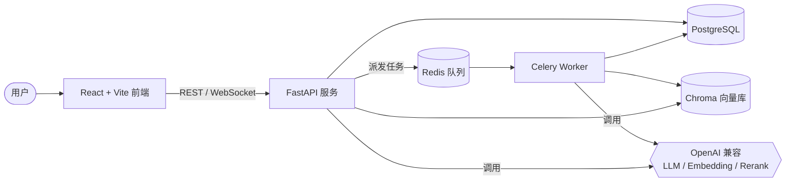
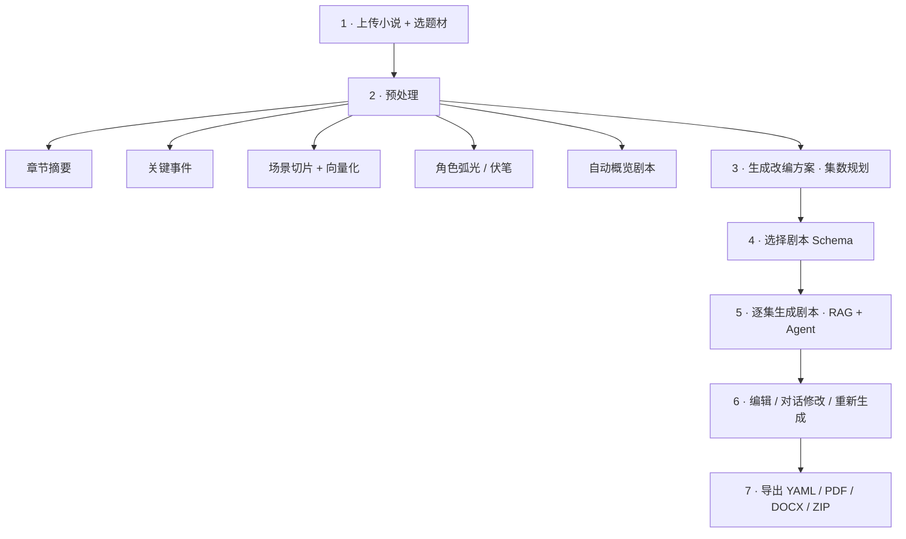
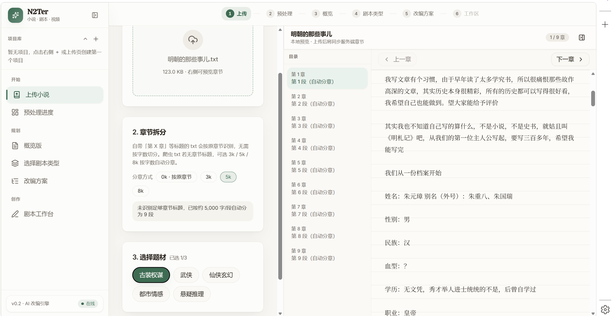
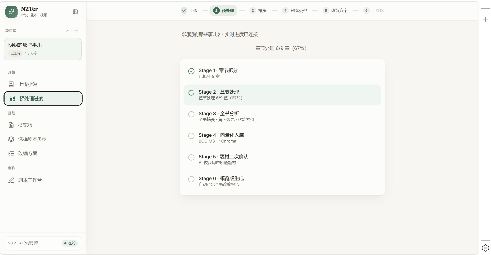
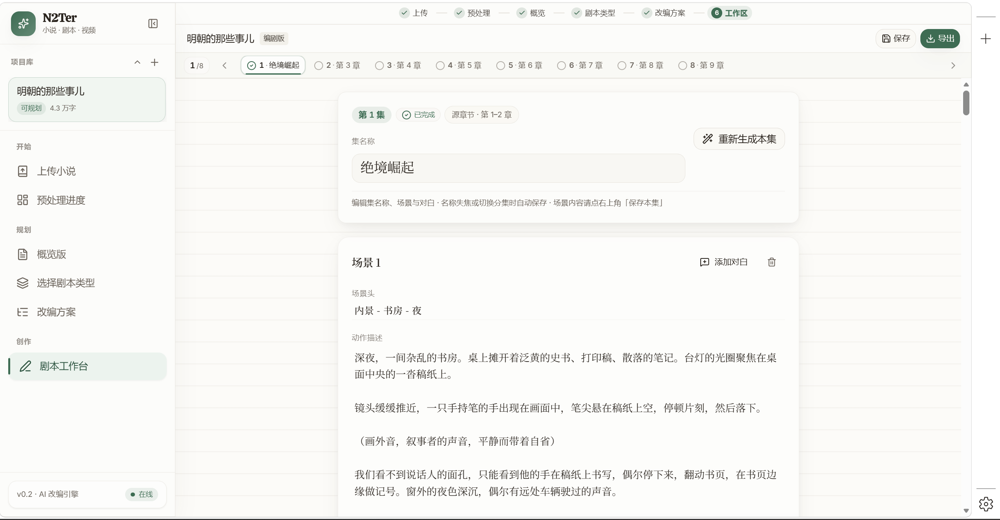

<div align="center">

# 📖 N2Ter · Novel → Screenplay

**AI 小说转剧本工作站** —— 从一本小说，到可拍摄的分集剧本与 AI 视频脚本

把长篇小说自动拆解、分析、改编为**分集剧本**、**AI 视频分镜脚本**或**剧情概览**，
全流程由检索增强（RAG）的多步 Agent 驱动，支持实时进度、对话式修改与一键导出。

<br/>


</div>

---

## 🎬 Demo 视频

> 完整流程演示（上传 → 预处理 → 改编方案 → 生成剧本 → 编辑导出）：

**▶ [Bilibili 项目演示](https://www.bilibili.com/video/BV1mREx6KEEr/?vd_source=1c0e3b5502b55dc977c3f0092d977c48)**

---

## ✨ 功能亮点

| | 功能 | 说明 |
|---|---|---|
| 📥 | **智能拆章 + 预处理** | 上传整本小说，自动按字数拆章，并行做摘要、关键事件、场景切片、角色弧光、伏笔分析 |
| 🧠 | **检索增强生成（RAG）** | 场景文本向量化入库，生成时用「向量召回 + 重排」取证原文，剧本忠于原著细节 |
| 🤖 | **多步 ReAct Agent** | 手写工具调用循环（无框架依赖）：Agent 自主读章节、检索片段、查人物时间线后再落笔 |
| 🎞️ | **三种产物 Schema** | `ai_video` 分镜脚本 / `screenwriter` 编剧工作版 / `overview` 剧情概览，一套小说多种产物 |
| ⚡ | **逐场并行生成** | 一集内多个场景并发起草，配合预算收敛，长集生成速度提升数倍 |
| 📡 | **实时执行过程** | WebSocket 推送 Agent 每一步（规划大纲 → 检索原著 → 逐场撰写），前端实时可见 |
| 💬 | **对话式修改** | 内置编辑 Agent，可查询章节、改写集数、更新连续性记忆；超长对话自动压缩 |
| 🔁 | **按需重新生成** | 对最新一集填写「修改方向」即可让 Agent 带指令重写，旧集保护连续性、仅支持手动微调 |
| 🧩 | **优雅降级** | 未配置 LLM 时全链路走确定性 fallback，主流程仍可完整演示 |
| 📦 | **多格式导出** | YAML / PDF / DOCX / ZIP 一键导出，便于提交、排版与二次创作 |

---

## 🏗️ 系统架构



- **前端**：React 19 + TypeScript + Tailwind，单页工作台，状态用 Zustand 管理。
- **API**：FastAPI（全异步 SQLAlchemy 2.0 + asyncpg），既服务 REST，也承载对话与进度的 WebSocket。
- **Worker**：Celery + Redis 跑预处理 / 生成等重任务；前端轮询 + WebSocket 实时看进度。
- **存储**：PostgreSQL 存结构化数据，Chroma 存场景向量供 RAG 检索。
- **AI 接入**：纯 OpenAI 兼容协议，LLM / Embedding / Rerank **三者独立配置**，可自由混搭厂商。

---

## 🔄 端到端流程



1. **上传小说**：保存原文，按字数自动拆章，建立小说项目。
2. **预处理**：章节级摘要 / 关键事件 / 场景切片并发处理；全书角色弧光、伏笔分析；场景向量化写入 Chroma；自动产出一版概览剧本。
3. **改编方案**：基于章节生成集数规划，每集记录来源章节、标题与剧情概述。
4. **选择 Schema**：`ai_video`（镜头/画面/角色一致性）、`screenwriter`（场景/动作/对白/可编辑）、`overview`（核心冲突与结果）。
5. **生成剧本**：逐集、逐场由 Agent 结合原文、摘要、角色档案、前文记忆与检索结果落笔；每集自动起名。
6. **编辑与对话**：直接改剧本，或让对话 Agent 查询/改写；最新一集支持「带指令重新生成」。
7. **导出**：结构化与可阅读文档一并打包。

---

## 🔬 核心技术实现

<details open>
<summary><b>① 检索增强生成（RAG）流水线</b></summary>

预处理阶段把每个场景文本经 Embedding 写入 Chroma；生成 / 对话时，`chapter_search` 工具执行
**向量召回 → 重排（Rerank）→ 回填权威字段** 三段式检索，让 Agent 基于原文取证，避免"凭空编"。
向量库不可用时自动降级为 SQL 关键词检索，链路不中断。

</details>

<details>
<summary><b>② 手写多步 ReAct Agent（无框架依赖）</b></summary>

生成与对话都用自研的工具调用循环（OpenAI function-calling 格式），Agent 可调用
读章节、检索片段、查人物时间线、查伏笔、读改编方案/连续性记忆等工具；轮数与单工具调用次数均可配置，
兼容部分模型把工具调用"漏成文本"的情况并自动恢复，保证循环不中断。

</details>

<details>
<summary><b>③ 逐场并行 + 预算收敛的整集生成</b></summary>

一集拆成「大纲 → 逐场起草 → 装配」三段；多个场景用信号量**并发起草**（默认 4 路），
每段 ReAct 步数有上限，既避免触达模型输出上限，又把长集生成时间从分钟级压到几十秒。
全剧人物花名册统一注入，保证 `character_id` 在各场一致、标题在各集不重复。

</details>

<details>
<summary><b>④ 实时执行过程（WebSocket）</b></summary>

Worker 在生成时把每一步（规划大纲 / 检索原著 / 撰写第 N 场 / 本场完成）作为进度事件写库并推送，
前端通过 WebSocket + 轮询双通道接收、按场号有序展示、带计时器与完成态——随时能判断"在干活还是卡住"。

</details>

<details>
<summary><b>⑤ 对话上下文工程</b></summary>

对话超过阈值自动「锚点 + 压缩」总结历史、3 轮后自动生成标题、对关键决策消息自动置顶，
长对话也能保持上下文不爆、主线不丢。

</details>

<details>
<summary><b>⑥ 优雅降级与健壮性</b></summary>

每个外部 AI 能力都有确定性 fallback：无 Key 也能跑完整流程做演示。
Worker 重启时自动复位被中断的"孤儿任务"，卡住的集可一键重置——失败可恢复、不留僵尸态。

</details>

---

## 🖼️ 界面展示

> 截图放在 `docs/images/` 目录（PNG/JPG），按下列文件名放入即可在 README 直接展示。

| 上传小说 | 预处理进度 | 剧本编辑器 |
|---|---|---|
|  |  |  |

---

## 🚀 快速开始

### 方式一：Docker Compose（推荐）

一键拉起 API、Worker、PostgreSQL、Redis、Chroma 全套依赖。

```powershell
# 1) 配置环境变量
cd backend\docker
copy .env.example .env      # 然后按需填写 LLM / Embedding / Rerank

# 2) 启动后端全家桶（API 容器启动时自动执行 Alembic 迁移）
docker compose up --build           # 开发模式（热更新）
# docker compose -f docker-compose.yml up -d --build   # 生产风格后台启动

# 3) 启动前端
cd ..\..\frontend
npm install
npm run dev
```

启动后访问：

| 服务 | 地址 |
|---|---|
| 前端 | http://localhost:5173 |
| API 文档（Swagger） | http://localhost:8000/docs |
| 健康检查 | http://localhost:8000/health |
| PostgreSQL | localhost:55432 |
| Chroma | localhost:8001 |

> `LLM_API_KEY` 留空即进入 fallback 模式：不调用外部 AI，但上传 / 预处理 / 生成 / 导出主流程仍可演示。

### 方式二：本地开发（不使用 Docker）

需本机已有 PostgreSQL、Redis（按需启动 Chroma）。

```powershell
# 后端
cd backend
E:\miniconda3\envs\N2Ter\python.exe -m pip install -e ".[dev,pdf,vector]"
E:\miniconda3\envs\N2Ter\python.exe -m alembic upgrade head
E:\miniconda3\envs\N2Ter\python.exe -m uvicorn app.main:app --reload

# 启用异步任务（另开终端）
E:\miniconda3\envs\N2Ter\python.exe -m celery -A app.workers.celery_app worker -l info

# 前端（另开终端）
cd frontend && npm install && npm run dev
```

---

## ⚙️ 配置说明

三类模型**完全独立**，可自由混搭厂商（例如 LLM 用 DeepSeek、Embedding/Rerank 用 DashScope）。

| 变量 | 作用 | 备注 |
|---|---|---|
| `LLM_BASE_URL` / `LLM_API_KEY` / `LLM_MODEL` | 对话与生成的 LLM | 任意 OpenAI 兼容端点；留空走 fallback |
| `EMBEDDING_BASE_URL` / `EMBEDDING_API_KEY` / `EMBEDDING_MODEL` | 向量化（RAG 关键） | 独立配置，与 LLM 无关 |
| `RERANK_URL` / `RERANK_API_KEY` / `RERANK_MODEL` | 检索重排（可选） | 留空 = 透传不重排；DashScope 用 `/api/v1/services/rerank/...` |
| `ASYNC_TASKS_ENABLED` | 是否走 Celery 异步任务 | Compose 默认 `true` |
| `PREPROCESS_CONCURRENCY` | 预处理章节并发数 | 视厂商限速调整 |
| `EPISODE_SCENE_CONCURRENCY` | 整集生成时场景并发数 | 提速核心，默认 4 |
| `AGENT_MAX_ITERS` / `AGENT_TOOL_CALL_LIMIT` | 对话 Agent 轮数 / 工具调用上限 | 控制响应速度 |

> ⚠️ 推荐用非推理（chat）类模型做生成；推理模型常把工具调用/JSON 写成普通文本导致解析失败。

---

## 🧱 项目结构

```text
N2Ter/
├── frontend/              # React + Vite + TS 前端工作台
│   └── src/
│       ├── pages/         # 上传 / 预处理 / 改编方案 / 编辑器 等页面
│       ├── components/    # 编辑器画布、分集导航、导出/重生弹窗等
│       ├── stores/        # Zustand 全局状态
│       └── api/           # REST 客户端 + WebSocket 封装
├── backend/
│   └── app/
│       ├── routes/        # FastAPI 路由（含 WebSocket）
│       ├── services/      # 预处理 / 生成 / 检索 / 压缩 / 导出 等业务
│       ├── agents/        # ReAct Agent
│       ├── tools/         # Agent 可调用的工具集
│       ├── workers/       # Celery 任务
│       └── models/        # SQLAlchemy 模型
├── prompts/               # 各阶段 Prompt 模板
├── Schema/                # 三种剧本产物的 JSON Schema
└── backend/docker/        # docker-compose + Dockerfile + .env.example
```

---

## 🧪 测试与验证

```powershell
# 后端测试
cd backend
E:\miniconda3\envs\N2Ter\python.exe -m pytest

# 前端构建
cd frontend && npm run build

# 接口健康检查（返回 status: ok 即正常）
curl http://localhost:8000/health
```

---

## 📦 导出格式

| 格式 | 用途 |
|---|---|
| `YAML` | 结构化数据，供其它工具消费 |
| `PDF` | 人类可读、自定义排版（WeasyPrint） |
| `DOCX` | Word 文档，便于二次编辑（python-docx） |
| `ZIP` | 以上一次性打包，便于提交或归档 |

---

## 📝 注意事项

- 不要提交真实 `.env`、API Key、数据库密码等敏感信息。
- Docker Compose 默认包含 Worker，建议保持 `ASYNC_TASKS_ENABLED=true`。
- PDF 导出依赖 WeasyPrint 与系统字体/原生库；Docker 镜像已内置，Windows/Conda 本地导出见 `backend/README.md`（需安装 `pango`）。
- 生成 / 预处理运行期间请勿重建 Worker 容器，否则会中断在跑的任务（重启后会自动复位为可重试状态）。

---

<div align="center">

**N2Ter** · 让每一本小说，都能被"看见"。

</div>
